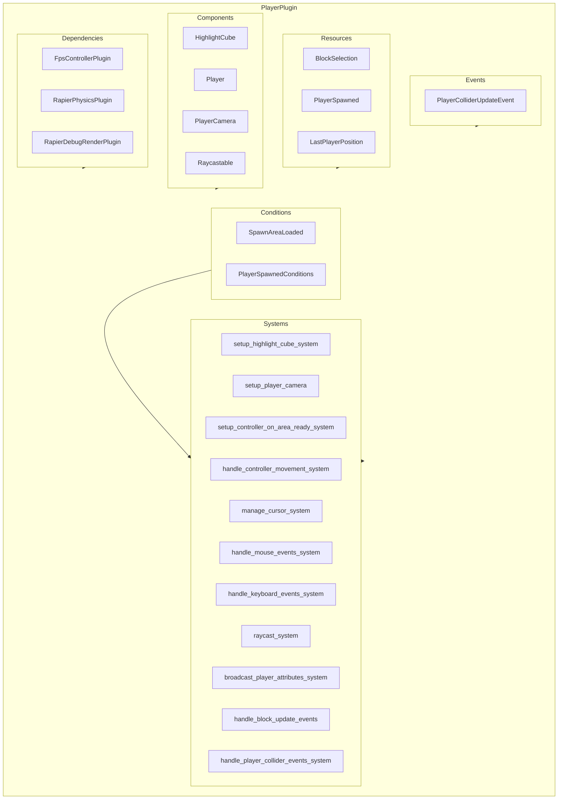

\`\`\`mermaid
classDiagram
    class PlayerPlugin {
        - FpsControllerPlugin
        - RapierPhysicsPlugin
        - RapierDebugRenderPlugin
        - RapierConfiguration
        - PlayerColliderUpdateEvent
        - Resources
        - Systems
    }

    %% Components
    class HighlightCube
    class Player
    class PlayerCamera
    class Raycastable

    %% Resources
    class BlockSelection {
        + position: Option<Vec3>
        + normal: Option<Vec3>
    }
    class PlayerSpawned {
        + is_spawned(): bool
        + is_not_spawned(): bool
    }
    class LastPlayerPosition {
        + position: Vec3
    }

    %% Events
    class PlayerColliderUpdateEvent

    %% Systems
    class SetupSystems {
        setup_highlight_cube_system
        setup_player_camera
    }
    class UpdateSystems {
        setup_controller_on_area_ready_system
        handle_controller_movement_system
        manage_cursor_system
        handle_mouse_events_system
        handle_keyboard_events_system
        raycast_system
        handle_block_update_events
        broadcast_player_attributes_system
        handle_player_collider_events_system
    }

    PlayerPlugin --|> HighlightCube
    PlayerPlugin --|> Player
    PlayerPlugin --|> PlayerCamera
    PlayerPlugin --|> Raycastable
    PlayerPlugin --> BlockSelection
    PlayerPlugin --> PlayerSpawned
    PlayerPlugin --> LastPlayerPosition
    PlayerPlugin --> PlayerColliderUpdateEvent
    PlayerPlugin --> SetupSystems
    PlayerPlugin --> UpdateSystems
\`\`\`

\`\`\`mermaid
sequenceDiagram
    participant App
    participant PlayerPlugin
    participant Resources
    participant Systems
    participant Physics
    participant Render

    note over App,PlayerPlugin: Startup Phase
    App->>PlayerPlugin: Add FpsControllerPlugin
    App->>PlayerPlugin: Add RapierPhysicsPlugin
    App->>PlayerPlugin: Add RapierDebugRenderPlugin
    PlayerPlugin->>Resources: Insert RapierConfiguration
    PlayerPlugin->>Resources: Add BlockSelection, PlayerSpawned, LastPlayerPosition
    PlayerPlugin->>Systems: Add Startup Systems (setup_highlight_cube_system, setup_player_camera)

    note over App,PlayerPlugin: Update Phase
    App->>Systems: Run setup_controller_on_area_ready_system
    Systems->>Resources: Check PlayerSpawned, SpawnAreaLoaded
    Systems->>Render: Setup player camera
    Systems->>Physics: Add Player Collider

    App->>Systems: Run handle_controller_movement_system
    Systems->>Resources: Update LastPlayerPosition
    Systems->>Events: Trigger PlayerColliderUpdateEvent

    App->>Systems: Run raycast_system
    Systems->>Resources: Update BlockSelection
    Systems->>Render: Update HighlightCube Position

    App->>Systems: Run handle_mouse_events_system
    Systems->>Resources: Read BlockSelection
    Systems->>Events: Trigger BlockUpdateEvent

    App->>Systems: Run handle_block_update_events
    Systems->>Resources: Update Terrain Blocks
    Systems->>Events: Trigger ChunkMeshUpdateEvent

    App->>Systems: Run broadcast_player_attributes_system
    Systems->>Resources: Send Player State to Network

    App->>Systems: Run handle_player_collider_events_system
    Systems->>Events: Process PlayerColliderUpdateEvent
\`\`\`

