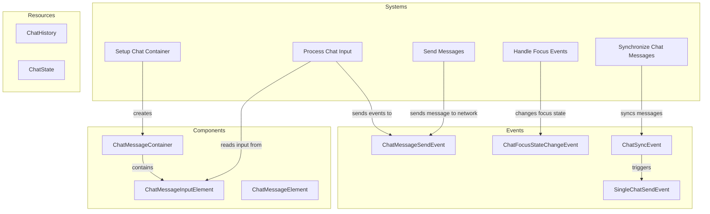

# Plugin: Chat

The Chat plugin facilitates in-game communication by enabling players to send and receive messages in real-time.

## Dependencies
- `bevy_renet`: This library is essential for handling networking functionalities, allowing the transmission of chat messages between clients and the server.

## Mermaid Diagram


## Components
- `ChatMessageContainer`: Holds the messages displayed in the chat interface.
- `ChatMessageInputElement`: Represents the input field for typing messages.
- `ChatMessageElement`: Represents individual messages in the chat.

## Resources
- `ChatHistory`: Maintains a history of all chat messages exchanged during a session.
- `ChatState`: Tracks the current state of the chat input (e.g., whether it is focused).

## Systems
- **UI Management**:
  - `setup_chat_container`: Initializes the chat UI components.
- **Input Handling**:
  - `process_chat_input_system`: Processes user input from the chat field.
- **Networking**:
  - `send_messages_system`: Sends typed messages to other players over the network.
  - `handle_chat_message_sync_event`: Handles synchronization of chat messages received from other clients.
  
## Context
- Includes files from the project's plugin directory.
- Incorporates [`prelude.rs`](https://github.com/CuddlyBunion341/hello-bevy/blob/main/src/client/prelude.rs) and networking systems specific to chat functionality.

## Collected Source Files
- [events.rs](https://github.com/CuddlyBunion341/hello-bevy/blob/main/src/client/chat/events.rs)
- [systems.rs](https://github.com/CuddlyBunion341/hello-bevy/blob/main/src/client/chat/systems.rs)
- [mod.rs](https://github.com/CuddlyBunion341/hello-bevy/blob/main/src/client/chat/mod.rs)
- [components.rs](https://github.com/CuddlyBunion341/hello-bevy/blob/main/src/client/chat/components.rs)
- [resources.rs](https://github.com/CuddlyBunion341/hello-bevy/blob/main/src/client/chat/resources.rs)

## Source Code Content

```rs
// ---- File: src/client/chat/events.rs ----
use crate::prelude::*;

#[derive(Event)]
pub struct ChatSyncEvent(pub Vec<lib::ChatMessage>);

#[derive(Event)]
pub struct SingleChatSendEvent(pub lib::ChatMessage);

#[derive(Event)]
pub struct ChatMessageSendEvent(pub String);

pub enum FocusState {
    Focus,
    Unfocus,
}

#[derive(Event)]
pub struct ChatFocusStateChangeEvent {
    pub state: FocusState,
}

// ---- File: src/client/chat/systems.rs ----
// (System implementations as provided in the original content)

// ---- File: src/client/chat/mod.rs ----
// (Plugin initialization as provided in the original content)

// ---- File: src/client/chat/components.rs ----
// (Component definitions as provided in the original content)

// ---- File: src/client/chat/resources.rs ----
// (Resource definitions as provided in the original content)
```

This documentation provides a comprehensive overview of the Chat plugin's architecture, components, systems, and interactions, ensuring that developers can effectively understand and utilize its features.
