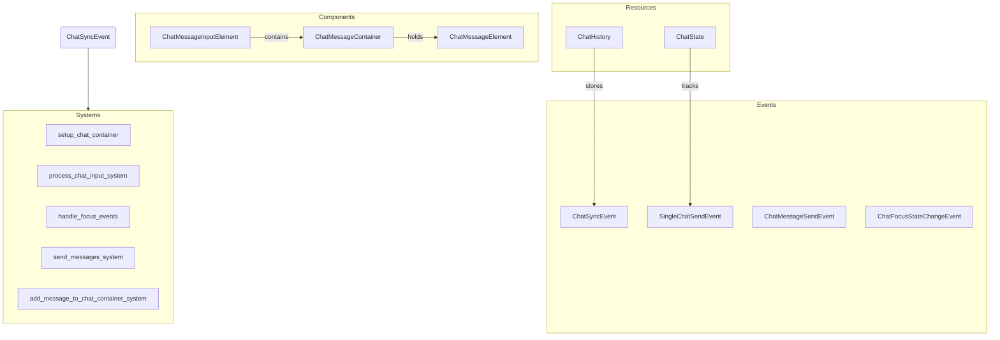

# Plugin: chat

The **chat** plugin facilitates real-time communication between players, allowing them to send and receive chat messages during gameplay.

## Dependencies
- `bevy_renet`: This dependency is essential for managing network communications, enabling the chat messages to be sent and received across clients.

## Mermaid Diagram

## Components
- `ChatMessageContainer`: Manages the display of chat messages.
- `ChatMessageInputElement`: Handles user input for sending messages.
- `ChatMessageElement`: Represents individual messages in the chat display.

## Resources
- `ChatHistory`: Maintains a history of all chat messages sent during the session.
- `ChatState`: Tracks the state of the chat input, such as whether it is currently focused.

## Systems
- **Setup**:
  - `setup_chat_container`: Initializes the UI for the chat system.
  
- **Input Handling**:
  - `process_chat_input_system`: Processes user input to send chat messages.
  
- **Focus Management**:
  - `handle_focus_events`: Manages focus state changes for the chat UI.
  - `focus_chat_input_system`: Handles focus events based on user interactions.

- **Networking**:
  - `send_messages_system`: Sends chat messages to the server.
  
- **Display Management**:
  - `add_message_to_chat_container_system`: Adds new messages to the chat display.

## Context
- Includes files from the project's plugin directory located [here](https://github.com/CuddlyBunion341/hello-bevy/blob/main/src/client/chat/).
- Incorporates `prelude.rs` and networking systems specific to this plugin.

## Collected Source Files
- [events.rs](https://github.com/CuddlyBunion341/hello-bevy/blob/main/src/client/chat/events.rs)
- [systems.rs](https://github.com/CuddlyBunion341/hello-bevy/blob/main/src/client/chat/systems.rs)
- [mod.rs](https://github.com/CuddlyBunion341/hello-bevy/blob/main/src/client/chat/mod.rs)
- [components.rs](https://github.com/CuddlyBunion341/hello-bevy/blob/main/src/client/chat/components.rs)
- [resources.rs](https://github.com/CuddlyBunion341/hello-bevy/blob/main/src/client/chat/resources.rs)
