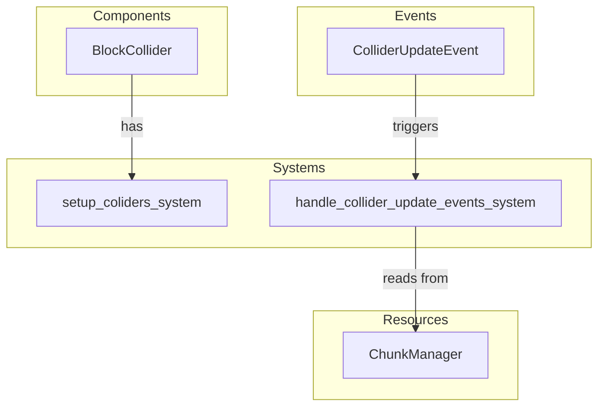

# Plugin: Collider

The Collider plugin facilitates the management of colliders within the ECS framework, enabling efficient collision detection and response in a 3D environment.

## Dependencies
- `bevy`: The primary game engine used for rendering and managing game state.
- `bevy_rapier3d`: Provides physics capabilities including collision detection and rigid body dynamics.

## Mermaid Diagram


## Components
- `BlockCollider`: Represents a collider with a defined relative position, used to detect collisions within the game world.

## Resources
- `ChunkManager`: Manages chunks of the game world, facilitating retrieval and updates of block states for collision calculations.

## Systems
- **Setup**:
  - `setup_coliders_system`: Initializes the collider grid by spawning BlockCollider entities based on a predefined size.
- **Update**:
  - `handle_collider_update_events_system`: Responds to ColliderUpdateEvents to update collider positions based on world changes.

## Context
- Includes files from the project's plugin directory.
- Incorporates [`prelude.rs`](https://github.com/CuddlyBunion341/hello-bevy/blob/main/src/client/prelude.rs) and networking systems specific to the plugin.

## Collected Source Files
- [events.rs](https://github.com/CuddlyBunion341/hello-bevy/blob/main/src/client/collider/events.rs)
- [systems.rs](https://github.com/CuddlyBunion341/hello-bevy/blob/main/src/client/collider/systems.rs)
- [mod.rs](https://github.com/CuddlyBunion341/hello-bevy/blob/main/src/client/collider/mod.rs)
- [components.rs](https://github.com/CuddlyBunion341/hello-bevy/blob/main/src/client/collider/components.rs)

## Source Code Content

```rs
// ---- File: src/client/collider/events.rs ----
use crate::prelude::*;

#[derive(Event)]
pub struct ColliderUpdateEvent {
    pub grid_center_position: [f32; 3],
}

// ---- File: src/client/collider/systems.rs ----
use crate::prelude::*;

static COLLIDER_GRID_SIZE: u32 = 3;
static COLLIDER_RESTING_POSITION: Vec3 = Vec3::ZERO;

pub fn setup_coliders_system(mut commands: Commands) {
    let collider_range = 0..COLLIDER_GRID_SIZE;

    for x in collider_range.clone() {
        for y in collider_range.clone() {
            for z in collider_range.clone() {
                commands
                    .spawn(Collider::cuboid(0.5, 0.5, 0.5))
                    .insert(TransformBundle::from(Transform::from_xyz(
                        x as f32, y as f32, z as f32,
                    )))
                    .insert(collider_components::BlockCollider {
                        relative_position: Vec3 {
                            x: x as f32,
                            y: y as f32,
                            z: z as f32,
                        },
                    });
            }
        }
    }
}

pub fn handle_collider_update_events_system(
    mut collider_grid_events: EventReader<collider_events::ColliderUpdateEvent>,
    mut query: Query<(&mut Transform, &collider_components::BlockCollider)>,
    mut chunk_manager: ResMut<terrain_resources::ChunkManager>,
) {
    for event in collider_grid_events.read() {
        let event_position = Vec3::new(
            event.grid_center_position[0],
            event.grid_center_position[1],
            event.grid_center_position[2],
        )
        .floor();
        for (mut transform, collider) in query.iter_mut() {
            let relative_position = collider.relative_position;
            let collider_position = (event_position + relative_position).floor();
            let block = chunk_manager.get_block(collider_position);

            match block {
                Some(block) => {
                    if block != BlockId::Air {
                        transform.translation = collider_position + 0.5;
                    } else {
                        transform.translation = COLLIDER_RESTING_POSITION;
                    }
                }
                None => {
                    transform.translation = COLLIDER_RESTING_POSITION;
                }
            }
        }
    }
}

#[cfg(test)]
mod tests {
    use collider_events::ColliderUpdateEvent;

    use super::*;
    
    fn setup_app() -> App {
        let mut app = App::new();
        app.add_plugins(MinimalPlugins);
        app
    }

    #[test]
    fn test_setup_coliders_system() {
        let mut app = setup_app();
        app.add_systems(Startup, setup_coliders_system);
        
        app.update();

        let mut colliders_query = app.world.query::<&collider_components::BlockCollider>();
        let colliders_count = colliders_query.iter(&app.world).count();

        assert_eq!(colliders_count, 3 * 3 * 3);
    }

    #[test]
    fn test_handle_collider_update_events_system() {
        let mut app = App::new();

        app.add_event::<collider_events::ColliderUpdateEvent>();
        app.add_systems(Update, handle_collider_update_events_system);
        app.insert_resource(terrain_resources::ChunkManager::new());

        app.world.spawn((
            Transform {
                translation: Vec3 { x: 0.0, y: 0.0, z: 0.0 },
                ..Default::default()
            },
            collider_components::BlockCollider {
                relative_position: Vec3 { x: 1.0, y: 2.0, z: 3.0 },
            },
        ));

        let block = BlockId::Dirt;
        let mut resource = app.world.get_resource_mut::<terrain_resources::ChunkManager>().unwrap();
        
        let chunks = terrain_resources::ChunkManager::instantiate_chunks(Vec3 { x: 0.0, y: 0.0, z: 0.0 }, 1);
        
        resource.insert_chunks(chunks);
        resource.set_block(Vec3 { x: 6.0, y: 7.0, z: 8.0 }, block);

        app.world.send_event(ColliderUpdateEvent { grid_center_position: [5.0, 5.0, 5.0] });

        app.update();

        let mut collider_query = app.world.query::<(&Transform, &collider_components::BlockCollider)>();
        
        let (collider_transform, _) = collider_query.single(&app.world);
        
        assert_eq!(Vec3 { x: 6.5, y: 7.5, z: 8.5 }, collider_transform.translation);
    }
}

// ---- File: src/client/collider/mod.rs ----
pub mod components;
pub mod events;
pub mod systems;

use crate::prelude::*;

pub struct ColliderPlugin;

impl Plugin for ColliderPlugin {
    fn build(&self, app: &mut App) {
        app.add_systems(Startup, collider_systems::setup_coliders_system);
        app.add_event::<collider_events::ColliderUpdateEvent>();
        app.add_systems(Update, collider_systems::handle_collider_update_events_system);
    }
}

// ---- File: src/client/collider/components.rs ----
use crate::prelude::*;

#[derive(Component)]
pub struct BlockCollider {
    pub relative_position: Vec3,
}
```
