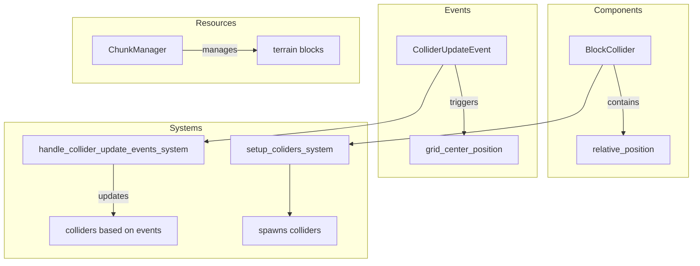

# Plugin: collider

The **collider** plugin provides functionality for managing and updating colliders in a 3D space, allowing for efficient collision detection and response within the game environment.

## Dependencies
- `bevy_rapier3d`: A physics engine that facilitates 3D collision detection and physics simulations.

## Mermaid Diagram

## Components
- `BlockCollider`: Defines the position of a collider relative to its parent entity.

## Resources
- `ChunkManager`: Responsible for managing terrain blocks, including retrieving block information for collider updates.

## Systems
- **Setup Systems**:
  - `setup_coliders_system`: Initializes and spawns colliders in the 3D space.
  
- **Update Systems**:
  - `handle_collider_update_events_system`: Responds to collider update events and adjusts collider positions based on current terrain state.

## Context
- Includes files from the project's plugin directory.
- Incorporates [`prelude.rs`](https://github.com/CuddlyBunion341/hello-bevy/blob/main/src/client/prelude.rs) for standard imports and networking systems specific to the plugin.

## Collected Source Files
- [events.rs](https://github.com/CuddlyBunion341/hello-bevy/blob/main/src/client/collider/events.rs)
- [systems.rs](https://github.com/CuddlyBunion341/hello-bevy/blob/main/src/client/collider/systems.rs)
- [mod.rs](https://github.com/CuddlyBunion341/hello-bevy/blob/main/src/client/collider/mod.rs)
- [components.rs](https://github.com/CuddlyBunion341/hello-bevy/blob/main/src/client/collider/components.rs)
