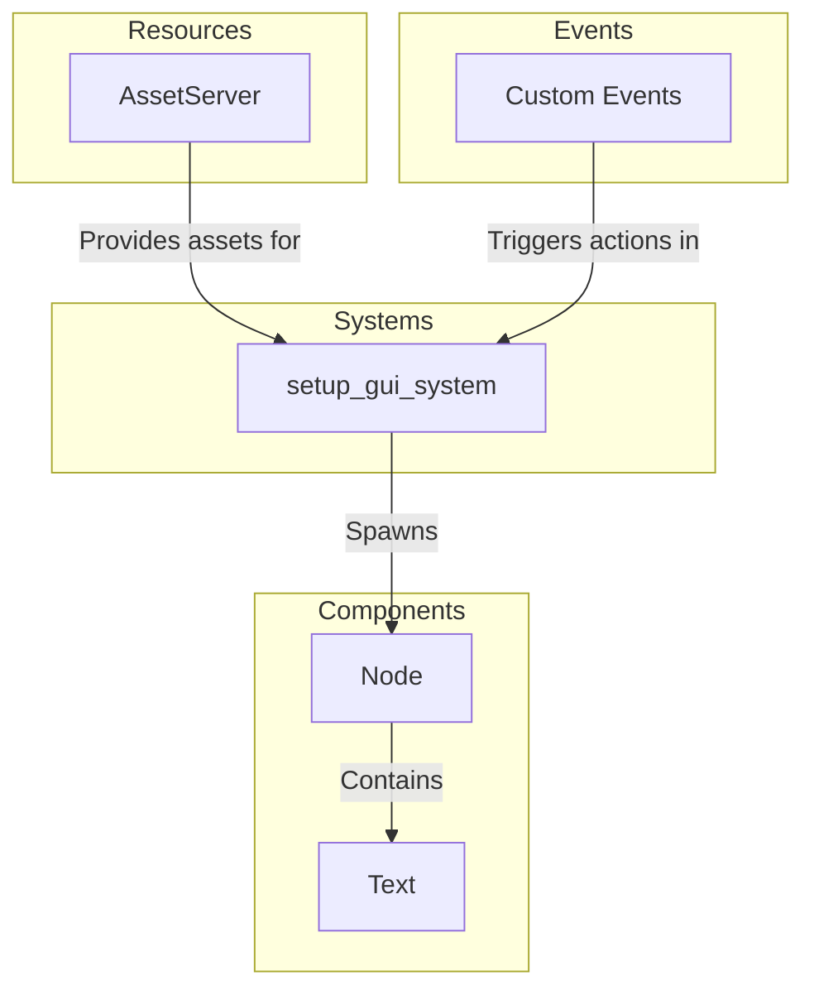

# Plugin: gui

The `gui` plugin provides the graphical user interface components for the application, facilitating user interaction and navigation.

## Dependencies
- **Bevy**: This game engine is essential for rendering graphics and handling game logic, allowing the implementation of the GUI.

## Mermaid Diagram

## Components
- **Node**: Acts as a container for UI elements, managing layout and positioning.
- **Text**: Displays textual information within the GUI, styled according to specified parameters.

## Resources
- **AssetServer**: Manages the loading and managing of assets such as fonts and textures used in the GUI.

## Systems
- **GUI Systems**:
  - **setup_gui_system**: Initializes the GUI by spawning necessary UI elements like nodes and text displays.

## Context
- Includes files from the project's plugin directory.
- Incorporates [`prelude.rs`](https://github.com/CuddlyBunion341/hello-bevy/blob/main/src/client/prelude.rs) which centralizes commonly used types and functionalities relevant to the GUI.

## Collected Source Files
- [events.rs](https://github.com/CuddlyBunion341/hello-bevy/blob/main/src/client/gui/events.rs)
- [systems.rs](https://github.com/CuddlyBunion341/hello-bevy/blob/main/src/client/gui/systems.rs)
- [mod.rs](https://github.com/CuddlyBunion341/hello-bevy/blob/main/src/client/gui/mod.rs)
- [components.rs](https://github.com/CuddlyBunion341/hello-bevy/blob/main/src/client/gui/components.rs)
