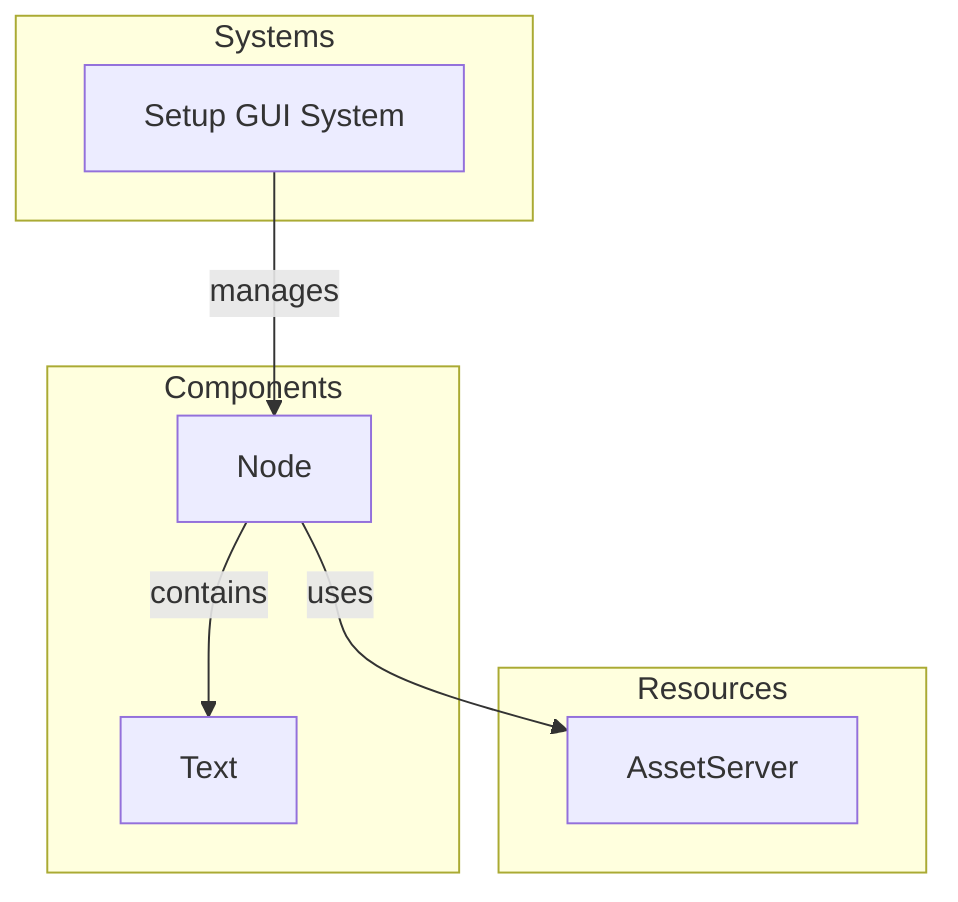

# Plugin: gui

The `gui` plugin provides a graphical user interface for the application, offering essential visual elements and layout functionalities.

## Dependencies
- **Bevy**: Utilized for game engine capabilities including rendering and input handling.

## Mermaid Diagram


## Components
- `Node`: Represents a UI node that can contain other UI elements.
- `Text`: Displays text on the screen, used for titles or messages.

## Resources
- `AssetServer`: Manages loading and handling assets such as fonts and textures.

## Systems
- **GUI Management**:
  - `setup_gui_system`: Initializes the GUI by spawning the main camera and setting up the UI node with child elements.

## Context
- Includes files from the project's plugin directory.
- Incorporates [`prelude.rs`](https://github.com/CuddlyBunion341/hello-bevy/blob/main/src/client/prelude.rs) for necessary imports and functionality related to systems.

## Collected Source Files
- [events.rs](https://github.com/CuddlyBunion341/hello-bevy/blob/main/src/client/gui/events.rs)
- [systems.rs](https://github.com/CuddlyBunion341/hello-bevy/blob/main/src/client/gui/systems.rs)
- [mod.rs](https://github.com/CuddlyBunion341/hello-bevy/blob/main/src/client/gui/mod.rs)
- [components.rs](https://github.com/CuddlyBunion341/hello-bevy/blob/main/src/client/gui/components.rs)

## Source Code Content

```rs
// ---- File: src/client/gui/events.rs ----


// ---- File: src/client/gui/systems.rs ----
use crate::prelude::*;

pub fn setup_gui_system(mut commands: Commands, asset_server: Res<AssetServer>) {
    commands.spawn(Camera2dBundle {
        camera: Camera {
            order: 2,
            ..default()
        },
        ..default()
    });
    commands
        .spawn(NodeBundle {
            style: Style {
                width: Val::Percent(100.0),
                height: Val::Percent(100.0),
                align_items: AlignItems::FlexStart,
                justify_content: JustifyContent::FlexStart,
                padding: UiRect {
                    left: Val::Px(5.0),
                    right: Val::Px(5.0),
                    top: Val::Px(5.0),
                    bottom: Val::Px(5.0),
                },
                ..default()
            },
            ..default()
        })
        .with_children(|parent| {
            parent.spawn(TextBundle {
                text: Text::from_section(
                    "RSMC - Pre Alpha",
                    TextStyle {
                        font: asset_server.load("fonts/Terminus500.ttf"),
                        font_size: 60.0,
                        color: Color::rgb(0.9, 0.9, 0.9),
                    },
                ),
                ..Default::default()
            });
        });
}

// ---- File: src/client/gui/mod.rs ----
pub mod components;
pub mod events;
pub mod systems;

use crate::prelude::*;

pub struct GuiPlugin;

impl Plugin for GuiPlugin {
    fn build(&self, app: &mut App) {
        app.add_systems(Startup, gui_systems::setup_gui_system);
    }
}

// ---- File: src/client/gui/components.rs ----


// ---- File: src/client/networking/systems.rs ----
use crate::prelude::*;

#[allow(clippy::too_many_arguments)]
pub fn receive_message_system(
    mut client: ResMut<RenetClient>,
    // other parameters...
) {
    // implementation...
}
```
