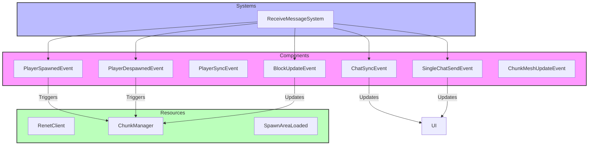

# Plugin: Networking

The Networking plugin facilitates communication between clients and the server, allowing for real-time interactions within the game.

## Dependencies
- **Renet**: This library provides low-level networking capabilities crucial for establishing connections and handling message transmission.

## Mermaid Diagram

## Components
- **PlayerSpawnedEvent**: Triggers when a new player joins the game.
- **PlayerDespawnedEvent**: Triggers when a player leaves the game.
- **BlockUpdateEvent**: Represents changes to blocks in the game world.
- **ChatSyncEvent**: Handles synchronized chat messages.
- **SingleChatSendEvent**: Manages individual chat messages sent by players.

## Resources
- **RenetClient**: Manages client connections and message handling.
- **ChunkManager**: Responsible for managing chunks of terrain data.
- **SpawnAreaLoaded**: Indicates whether the spawn area has been loaded.

## Systems
- **Networking Systems**:
  - `ReceiveMessageSystem`: Processes incoming messages from the server, triggering appropriate events based on the message type.

## Context
- Includes files from the project's plugin directory located at [src/client/networking](https://github.com/CuddlyBunion341/hello-bevy/blob/main/src/client/networking).
- Incorporates `prelude.rs` and networking systems specific to this plugin.

## Collected Source Files
- [systems.rs](https://github.com/CuddlyBunion341/hello-bevy/blob/main/src/client/networking/systems.rs)
- [mod.rs](https://github.com/CuddlyBunion341/hello-bevy/blob/main/src/client/networking/mod.rs)
