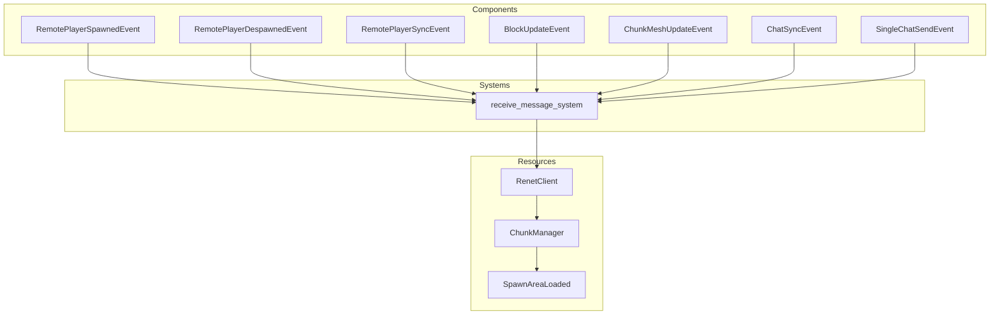

# Plugin: Networking

The Networking plugin enables communication between the client and server, facilitating real-time interactions in the application. It handles message reception, player synchronization, block updates, and chat functionalities.

## Dependencies
- **`renet`**: This library is essential for handling low-level networking tasks, such as establishing connections and managing data transmission.

## Mermaid Diagram


## Components
- **`RemotePlayerSpawnedEvent`**: Triggered when a new player joins the game.
- **`RemotePlayerDespawnedEvent`**: Triggered when a player leaves the game.
- **`RemotePlayerSyncEvent`**: Contains data for synchronizing remote players' states.
- **`BlockUpdateEvent`**: Represents updates to blocks in the game world.
- **`ChunkMeshUpdateEvent`**: Notifies when a chunk mesh should be updated.
- **`ChatSyncEvent`**: Contains synchronized chat messages from players.
- **`SingleChatSendEvent`**: Represents a single chat message sent by a player.

## Resources
- **`RenetClient`**: Manages client connections and communication.
- **`ChunkManager`**: Handles loading and updating chunks of the game world.
- **`SpawnAreaLoaded`**: Indicates whether the spawn area is fully loaded.

## Systems
- **Networking Systems**:
  - **`receive_message_system`**: Processes incoming messages from the network, handling player events, block updates, and chat messages.

## Context
This plugin includes files from the project's plugin directory. It incorporates [`prelude.rs`](https://github.com/CuddlyBunion341/hello-bevy/blob/main/src/client/prelude.rs) for common definitions and networking systems specific to the client.

## Collected Source Files
- [systems.rs](https://github.com/CuddlyBunion341/hello-bevy/blob/main/src/client/networking/systems.rs)
- [mod.rs](https://github.com/CuddlyBunion341/hello-bevy/blob/main/src/client/networking/mod.rs)

## Source Code Content

```rust
// ---- File: src/client/networking/systems.rs ----
use crate::prelude::*;

#[allow(clippy::too_many_arguments)]
pub fn receive_message_system(
    mut client: ResMut<RenetClient>,
    mut player_spawn_events: ResMut<Events<remote_player_events::RemotePlayerSpawnedEvent>>,
    mut player_despawn_events: ResMut<Events<remote_player_events::RemotePlayerDespawnedEvent>>,
    mut player_sync_events: ResMut<Events<remote_player_events::RemotePlayerSyncEvent>>,
    mut block_update_events: ResMut<Events<terrain_events::BlockUpdateEvent>>,
    mut chunk_manager: ResMut<terrain_resources::ChunkManager>,
    mut chunk_mesh_events: ResMut<Events<terrain_events::ChunkMeshUpdateEvent>>,
    mut chat_events: ResMut<Events<chat_events::ChatSyncEvent>>,
    mut single_chat_events: ResMut<Events<chat_events::SingleChatSendEvent>>,
    mut spawn_area_loaded: ResMut<terrain_resources::SpawnAreaLoaded>,
) {
    while let Some(message) = client.receive_message(DefaultChannel::ReliableOrdered) {
        match bincode::deserialize(&message) {
            Ok(message) => match message {
                lib::NetworkingMessage::PlayerJoin(event) => {
                    player_spawn_events.send(remote_player_events::RemotePlayerSpawnedEvent {
                        client_id: event,
                        position: Vec3::ZERO,
                    });
                }
                lib::NetworkingMessage::PlayerLeave(event) => {
                    player_despawn_events.send(remote_player_events::RemotePlayerDespawnedEvent {
                        client_id: event,
                    });
                }
                lib::NetworkingMessage::BlockUpdate { position, block } => {
                    debug!("Client received block update message: {:?}", position);
                    block_update_events.send(terrain_events::BlockUpdateEvent {
                        position,
                        block,
                        from_network: true,
                    });
                }
                lib::NetworkingMessage::ChatMessageSync(messages) => {
                    info!("Client received {} chat messages", messages.len());
                    chat_events.send(chat_events::ChatSyncEvent(messages));
                }
                lib::NetworkingMessage::SingleChatMessageSync(message) => {
                    info!("Client received chat message {}", message.message);
                    single_chat_events.send(chat_events::SingleChatSendEvent(message));
                }
                _ => {
                    warn!("Received unknown message type. (ReliableOrdered)");
                }
            },
            Err(message) => {
                error!("Could not deserialize message {:?}", message);
            }
        }
    }

    while let Some(message) = client.receive_message(DefaultChannel::ReliableUnordered) {
        let message = bincode::deserialize(&message);

        if message.is_err() {
            error!("Failed to deserialize message.");
            continue;
        }

        if let Ok(message) = message {
            debug!("Received message: {:?}", message);
            match message {
                lib::NetworkingMessage::ChunkBatchResponse(chunks) => {
                    info!("Client received chunk batch response message.");
                    for chunk in chunks {
                        info!(
                            "Client received chunk response message for: {:?}",
                            chunk.position
                        );
                        let chunk_position = chunk.position;
                        chunk_manager.insert_chunk(chunk);
                        chunk_mesh_events.send(terrain_events::ChunkMeshUpdateEvent {
                            position: chunk_position,
                        });

                        if chunk_position.eq(&Vec3 {
                            x: 0.0,
                            y: 0.0,
                            z: 0.0,
                        }) {
                            info!("Spawn area loaded.");
                            spawn_area_loaded.0 = true;
                        }
                    }
                }
                lib::NetworkingMessage::PlayerSync(event) => {
                    player_sync_events.send(remote_player_events::RemotePlayerSyncEvent { players: event });
                }
                _ => {
                    warn!("Received unknown message type. (ReliableUnordered)");
                }
            }
        }
    }
}

// ---- File: src/client/networking/mod.rs ----
pub mod systems;

use renet::{ChannelConfig, SendType};

use crate::prelude::*;

const SERVER_ADDR: &str = "127.0.0.1:5000";

pub struct NetworkingPlugin;
impl Plugin for NetworkingPlugin {
    fn build(&self, app: &mut App) {
        app.add_plugins((RenetClientPlugin, NetcodeClientPlugin));

        let channel_config_unreliable = ChannelConfig {
            channel_id: 0,
            max_memory_usage_bytes: 1000 * 1024 * 1024,
            send_type: SendType::Unreliable,
        };

        let channel_config_reliable_ordered = ChannelConfig {
            channel_id: 1,
            max_memory_usage_bytes: 1000 * 1024 * 1024,
            send_type: SendType::ReliableOrdered { resend_time: Duration::from_millis(300), },
        };

        let channel_config_reliable_unordered = ChannelConfig {
            channel_id: 2,
            max_memory_usage_bytes: 1000 * 1024 * 1024,
            send_type: SendType::ReliableUnordered { resend_time: Duration::from_millis(300), },
        };

        let client = RenetClient::new(ConnectionConfig { 
            client_channels_config: Vec::<ChannelConfig>::from([channel_config_unreliable, channel_config_reliable_ordered, channel_config_reliable_unordered]),
            ..Default::default()
        });
        
        app.insert_resource(client);

        let client_id = rand::random::<u64>();
        let authentication = ClientAuthentication::Unsecure { 
            server_addr: SERVER_ADDR.parse().unwrap(),
            client_id,
            user_data: None,
            protocol_id: 0,
        };
        
        let socket = UdpSocket::bind("127.0.0.1:0").unwrap();
        
        let current_time = SystemTime::now().duration_since(SystemTime::UNIX_EPOCH).unwrap();
        
        let transport = NetcodeClientTransport::new(current_time, authentication, socket).unwrap();
        
        app.insert_resource(transport);
        
        app.add_systems(Update, networking_systems::receive_message_system);
    }
}
```
