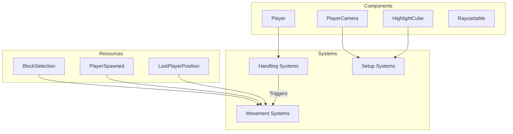

# Plugin: player

The player plugin manages player interactions, including movement, camera control, and event handling within the game environment.

## Dependencies
- **bevy:** Required for game engine functionalities including rendering, input handling, and system management.
- **bevy_fps_controller:** Enables first-person controller mechanics for player movement.
- **bevy_rapier3d:** Provides physics capabilities for realistic interactions and collisions.
- **bevy_renet:** Facilitates client-server networking for multiplayer capabilities.

## Mermaid Diagram

## Components
- **Player:** Represents the player entity with associated attributes and behaviors.
- **PlayerCamera:** Controls the player's viewpoint in the game world.
- **HighlightCube:** Used to visually indicate selectable blocks or areas.
- **Raycastable:** Marks entities that can be interacted with via raycasting.

## Resources
- **BlockSelection:** Holds information about the currently selected block's position and normal vector.
- **PlayerSpawned:** Tracks whether the player has been spawned in the game world.
- **LastPlayerPosition:** Stores the last known position of the player for tracking purposes.

## Systems
- **Setup Systems**:
  - `setup_highlight_cube_system`: Initializes the highlight cube for block selection visualization.
  - `setup_player_camera`: Sets up the player's camera system upon spawn.

- **Handling Systems**:
  - `handle_controller_movement_system`: Manages player movement based on input.
  - `handle_mouse_events_system`: Processes mouse interactions for block placement and removal.
  - `handle_keyboard_events_system`: Listens for keyboard inputs to trigger specific actions.

- **Movement Systems**:
  - `manage_cursor_system`: Handles mouse cursor visibility and locking during gameplay.
  - `raycast_system`: Performs raycasting to determine interactable objects in front of the player.

## Context
This plugin incorporates files from the project's plugin directory, including [prelude.rs](https://github.com/CuddlyBunion341/hello-bevy/blob/main/src/client/prelude.rs) which aggregates essential components, systems, and resources used throughout the plugin. Networking functionalities are also integrated into this plugin.

## Collected Source Files
- [events.rs](https://github.com/CuddlyBunion341/hello-bevy/blob/main/src/client/player/events.rs)
- [mod.rs](https://github.com/CuddlyBunion341/hello-bevy/blob/main/src/client/player/mod.rs)
- [components.rs](https://github.com/CuddlyBunion341/hello-bevy/blob/main/src/client/player/components.rs)
- [resources.rs](https://github.com/CuddlyBunion341/hello-bevy/blob/main/src/client/player/resources.rs)
- [terrain.rs](https://github.com/CuddlyBunion341/hello-bevy/blob/main/src/client/player/systems/terrain.rs)
- [controller.rs](https://github.com/CuddlyBunion341/hello-bevy/blob/main/src/client/player/systems/controller.rs)
- [keyboard.rs](https://github.com/CuddlyBunion341/hello-bevy/blob/main/src/client/player/systems/keyboard.rs)
- [selection.rs](https://github.com/CuddlyBunion341/hello-bevy/blob/main/src/client/player/systems/selection.rs)
- [mouse.rs](https://github.com/CuddlyBunion341/hello-bevy/blob/main/src/client/player/systems/mouse.rs)
- [network.rs](https://github.com/CuddlyBunion341/hello-bevy/blob/main/src/client/player/systems/network.rs)
