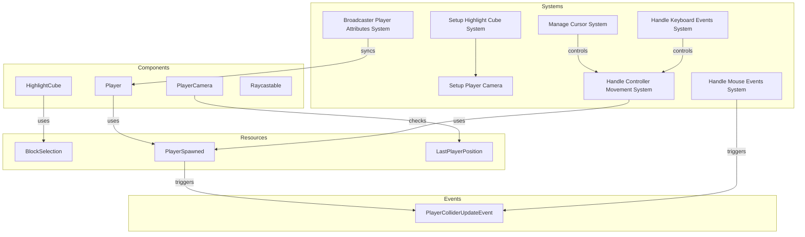

# Plugin: player

The Player plugin manages the player's interactions, movement, and camera in the game environment. It encompasses systems for handling input, collision detection, and player state synchronization over the network.

## Dependencies
- **bevy**: Required for game engine functionalities, including rendering and input handling.
- **bevy_rapier3d**: Provides physics capabilities essential for collision detection and player interactions.
- **bevy_fps_controller**: Facilitates first-person controller mechanics for smooth player navigation.
- **bevy_renet**: Handles networking functions to synchronize player states across clients.

## Mermaid Diagram

## Components
- `HighlightCube`: Used to indicate the block that can be interacted with by the player.
- `Player`: Represents the player entity within the game world.
- `PlayerCamera`: Manages the camera view associated with the player.
- `Raycastable`: Marks entities that can be detected using raycasting.

## Resources
- `BlockSelection`: Holds information about the currently selected block's position and normal vector.
- `PlayerSpawned`: Tracks whether the player has spawned in the game world.
- `LastPlayerPosition`: Stores the last known position of the player for collision detection purposes.

## Systems
- **Setup Systems**:
  - `setup_highlight_cube_system`: Initializes a visual indication of selectable blocks in the world.
  - `setup_player_camera`: Configures the player's camera view upon spawning.
  
- **Input Handling**:
  - `manage_cursor_system`: Controls mouse visibility and lock state based on user input.
  - `handle_mouse_events_system`: Processes mouse interactions with selectable blocks.
  - `handle_keyboard_events_system`: Manages keyboard input to trigger actions.

- **Game Logic**:
  - `handle_controller_movement_system`: Updates player position and handles movement events.
  - `broadcast_player_attributes_system`: Synchronizes player state across connected clients.

## Context
- Includes necessary files from the project's plugin directory.
- Incorporates `prelude.rs` for common imports and utilities pertinent to the plugin's functionality.

## Collected Source Files
- [events.rs](https://github.com/CuddlyBunion341/hello-bevy/blob/main/src/client/player/events.rs)
- [mod.rs](https://github.com/CuddlyBunion341/hello-bevy/blob/main/src/client/player/mod.rs)
- [components.rs](https://github.com/CuddlyBunion341/hello-bevy/blob/main/src/client/player/components.rs)
- [resources.rs](https://github.com/CuddlyBunion341/hello-bevy/blob/main/src/client/player/resources.rs)
- [terrain.rs](https://github.com/CuddlyBunion341/hello-bevy/blob/main/src/client/player/systems/terrain.rs)
- [controller.rs](https://github.com/CuddlyBunion341/hello-bevy/blob/main/src/client/player/systems/controller.rs)
- [keyboard.rs](https://github.com/CuddlyBunion341/hello-bevy/blob/main/src/client/player/systems/keyboard.rs)
- [selection.rs](https://github.com/CuddlyBunion341/hello-bevy/blob/main/src/client/player/systems/selection.rs)
- [mouse.rs](https://github.com/CuddlyBunion341/hello-bevy/blob/main/src/client/player/systems/mouse.rs)
- [network.rs](https://github.com/CuddlyBunion341/hello-bevy/blob/main/src/client/player/systems/network.rs)

## Source Code Content

Refer to individual source files for detailed implementations of events, components, resources, and systems.
