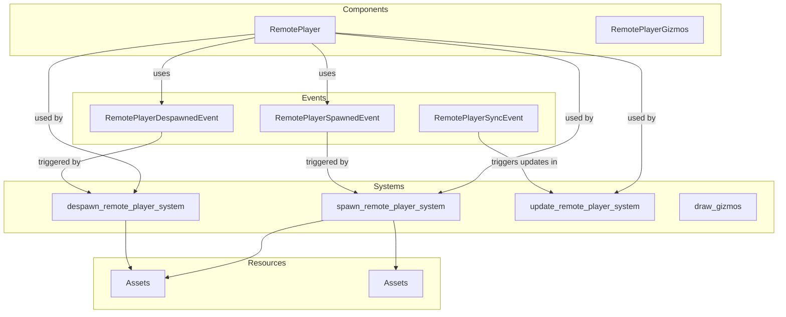

# Plugin: remote_player

The `remote_player` plugin facilitates the management of remote players in a multiplayer environment, enabling player spawning, despawning, and synchronization across clients.

## Dependencies
- **bevy**: The primary game engine framework used for building the application.
- **bevy_renet**: This library is essential for managing network connections and facilitating communication between clients.

## Mermaid Diagram


## Components
- `RemotePlayer`: Represents a player connected remotely, identified by a unique `client_id`.

## Resources
- `Assets<Mesh>`: Manages 3D mesh assets used to render remote players.
- `Assets<StandardMaterial>`: Handles the materials applied to the meshes of remote players.

## Systems
- **Player Management**:
  - `spawn_remote_player_system`: Handles the spawning of remote players when a spawn event is detected.
  - `despawn_remote_player_system`: Responsible for removing players from the game world upon receiving a despawn event.
  - `update_remote_player_system`: Synchronizes player states based on received data, updating positions and rotations as necessary.
  - `draw_gizmos`: Visualizes player positions in the editor using gizmos.

## Context
- Includes files from the project's plugin directory.
- Incorporates [prelude.rs](https://github.com/CuddlyBunion341/hello-bevy/blob/main/src/client/prelude.rs) and networking systems specific to remote players.

## Collected Source Files
- [events.rs](https://github.com/CuddlyBunion341/hello-bevy/blob/main/src/client/remote_player/events.rs)
- [systems.rs](https://github.com/CuddlyBunion341/hello-bevy/blob/main/src/client/remote_player/systems.rs)
- [mod.rs](https://github.com/CuddlyBunion341/hello-bevy/blob/main/src/client/remote_player/mod.rs)
- [components.rs](https://github.com/CuddlyBunion341/hello-bevy/blob/main/src/client/remote_player/components.rs)

## Source Code Content

```rs
// ---- File: src/client/remote_player/events.rs ----
use crate::prelude::*;

#[derive(Event)]
pub struct RemotePlayerSpawnedEvent {
    pub client_id: ClientId,
    pub position: Vec3,
}

#[derive(Event)]
pub struct RemotePlayerDespawnedEvent {
    pub client_id: ClientId,
}

#[derive(Event)]
pub struct RemotePlayerSyncEvent {
    pub players: HashMap<ClientId, lib::PlayerState>,
}

// ---- File: src/client/remote_player/systems.rs ----
use crate::prelude::*;

pub fn spawn_remote_player_system(
    mut commands: Commands,
    mut spawn_events: EventReader<remote_player_events::RemotePlayerSpawnedEvent>,
    mut meshes: ResMut<Assets<Mesh>>,
    mut materials: ResMut<Assets<StandardMaterial>>,
) {
    for event in spawn_events.read() {
        let client_id = event.client_id;

        let material = materials.add(StandardMaterial {
            base_color: Color::rgb(0.8, 0.7, 0.6),
            ..default()
        });

        commands.spawn((
            PbrBundle {
                mesh: meshes.add(Cuboid::new(0.5, 0.5, 0.5)),
                material,
                ..default()
            },
            remote_player_components::RemotePlayer { client_id },
        ));
    }
}

pub fn despawn_remote_player_system(
    mut commands: Commands,
    mut despawn_events: EventReader<remote_player_events::RemotePlayerDespawnedEvent>,
    query: Query<(Entity, &remote_player_components::RemotePlayer)>,
) {
    for event in despawn_events.read() {
        for (entity, remote_player) in query.iter() {
            if remote_player.client_id == event.client_id {
                commands.entity(entity).despawn();
            }
        }
    }
}

pub fn update_remote_player_system(
    mut sync_events: EventReader<remote_player_events::RemotePlayerSyncEvent>,
    mut spawn_events: EventWriter<remote_player_events::RemotePlayerSpawnedEvent>,
    mut query: Query<(&remote_player_components::RemotePlayer, &mut Transform)>,
) {
    let latest_event = sync_events.read().last();

    if let Some(event) = latest_event {
        for (client_id, player_state) in event.players.iter() {
            let mut player_exists = false;
            for (remote_player, mut transform) in query.iter_mut() {
                if remote_player.client_id == *client_id {
                    player_exists = true;
                    transform.translation = player_state.position + Vec3::new(0.0, 1.55, 0.0);
                    transform.rotation = player_state.rotation;
                }
            }

            if !player_exists {
                spawn_events.send(remote_player_events::RemotePlayerSpawnedEvent {
                    client_id: *client_id,
                    position: player_state.position,
                });
            }
        }
    }
}

pub fn draw_gizmos(
    mut player_gizmos: Gizmos<remote_player_components::RemotePlayerGizmos>,
    query: Query<(&remote_player_components::RemotePlayer, &Transform)>,
) {
    for (_, transform) in query.iter() {
        player_gizmos.ray(
            transform.translation,
            transform.rotation * Vec3::new(0.0, 0.0, -1.0),
            Color::rgb(0.8, 0.7, 0.6),
        );
    }
}

// ---- File: src/client/remote_player/mod.rs ----
pub mod components;
pub mod events;
pub mod systems;

use crate::prelude::*;

pub struct RemotePlayerPlugin;

impl Plugin for RemotePlayerPlugin {
    fn build(&self, app: &mut App) {
        app.add_event::<events::RemotePlayerSpawnedEvent>();
        app.init_gizmo_group::<remote_player_components::RemotePlayerGizmos>();
        app.add_event::<events::RemotePlayerDespawnedEvent>();
        app.add_event::<events::RemotePlayerSyncEvent>();
        app.add_systems(
            Update,
            (
                remote_player_systems::spawn_remote_player_system,
                remote_player_systems::update_remote_player_system,
                remote_player_systems::despawn_remote_player_system,
                remote_player_systems::draw_gizmos,
            ),
        );
    }
}

// ---- File: src/client/remote_player/components.rs ----
use crate::prelude::*;

#[derive(Component)]
pub struct RemotePlayer {
    pub client_id: ClientId,
}

#[derive(Default, Reflect, GizmoConfigGroup)]
pub struct RemotePlayerGizmos;

// ---- File: src/client/prelude.rs ----
// std crates and dependencies omitted for brevity...

// my crates omitted for brevity...
```
