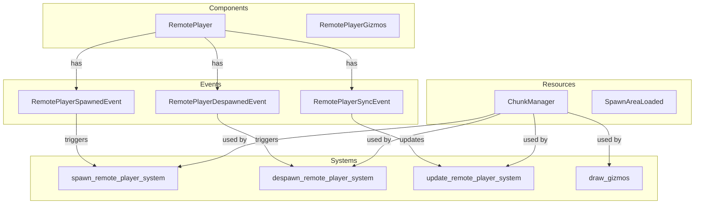

# Plugin: remote_player

The `remote_player` plugin facilitates the management of remote player entities in a multiplayer environment, enabling synchronization and interaction between clients.

## Dependencies
- **Bevy**: The primary game engine upon which the plugin is built, providing essential systems and components for game development.

## Mermaid Diagram

## Components
- **RemotePlayer**: Represents a remote player in the game, holding the client's unique identifier.
- **RemotePlayerGizmos**: Provides visualization for the remote player entities.

## Resources
- **ChunkManager**: Manages chunks of terrain data for the game world.
- **SpawnAreaLoaded**: Indicates whether the spawn area has been loaded.

## Systems
- **Player Management**:
  - `spawn_remote_player_system`: Handles the spawning of remote players based on received events.
  - `despawn_remote_player_system`: Manages the removal of players from the world when they disconnect.
  - `update_remote_player_system`: Synchronizes player states across clients.
  - `draw_gizmos`: Draws visual representations of remote players for debugging purposes.

## Context
- Includes files from the project's plugin directory located at [src/client/remote_player](https://github.com/CuddlyBunion341/hello-bevy/blob/main/src/client/remote_player).
- Incorporates [`prelude.rs`](https://github.com/CuddlyBunion341/hello-bevy/blob/main/src/client/prelude.rs) for essential imports and networking systems specific to remote player management.

## Collected Source Files
- [events.rs](https://github.com/CuddlyBunion341/hello-bevy/blob/main/src/client/remote_player/events.rs)
- [systems.rs](https://github.com/CuddlyBunion341/hello-bevy/blob/main/src/client/remote_player/systems.rs)
- [mod.rs](https://github.com/CuddlyBunion341/hello-bevy/blob/main/src/client/remote_player/mod.rs)
- [components.rs](https://github.com/CuddlyBunion341/hello-bevy/blob/main/src/client/remote_player/components.rs)

This documentation provides an overview of the `remote_player` plugin's structure and functionality within the Bevy framework. For further details, please refer to the linked source files.
