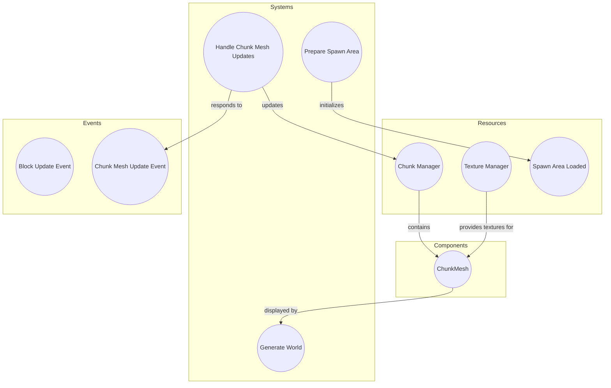

# Plugin: terrain

The Terrain plugin provides functionalities for managing and rendering a voxel-based terrain system, including chunk management, mesh generation, and networking support for multiplayer environments.

## Dependencies
- `bevy`: Required for the engine framework that the plugin operates within.
- `renet`: Used for networking capabilities, enabling communication between clients in the multiplayer setup.

## Mermaid Diagram

## Components
- `ChunkMesh`: Represents the mesh data associated with a terrain chunk, facilitating rendering in the scene.

## Resources
- `ChunkManager`: Manages the storage and retrieval of chunks in the terrain, ensuring efficient access and updates.
- `TextureManager`: Handles texture mapping for different block types in the terrain.
- `SpawnAreaLoaded`: Indicates whether the initial spawn area has been loaded.

## Systems
- **Terrain Management**:
  - `PrepareSpawnAreaSystem`: Prepares the initial area for spawning entities by requesting necessary chunks.
  - `GenerateWorldSystem`: Generates the world by requesting additional chunks based on player position.
  - `HandleChunkMeshUpdateEvents`: Processes events related to mesh updates for chunks, updating visuals as needed.

## Context
- Includes files from the project's plugin directory. 
- Incorporates [`prelude.rs`](https://github.com/CuddlyBunion341/hello-bevy/blob/main/src/client/prelude.rs) and networking systems specific to this plugin.

## Collected Source Files
- [events.rs](https://github.com/CuddlyBunion341/hello-bevy/blob/main/src/client/terrain/events.rs)
- [chunk.rs](https://github.com/CuddlyBunion341/hello-bevy/blob/main/src/client/terrain/util/chunk.rs)
- [mesher.rs](https://github.com/CuddlyBunion341/hello-bevy/blob/main/src/client/terrain/util/mesher.rs)
- [buffer_serializer.rs](https://github.com/CuddlyBunion341/hello-bevy/blob/main/src/client/terrain/util/buffer_serializer.rs)
- [mod.rs](https://github.com/CuddlyBunion341/hello-bevy/blob/main/src/client/terrain/mod.rs)
- [blocks.rs](https://github.com/CuddlyBunion341/hello-bevy/blob/main/src/client/terrain/util/blocks.rs)
- [systems.rs](https://github.com/CuddlyBunion341/hello-bevy/blob/main/src/client/terrain/systems.rs)
- [components.rs](https://github.com/CuddlyBunion341/hello-bevy/blob/main/src/client/terrain/components.rs)
- [resources.rs](https://github.com/CuddlyBunion341/hello-bevy/blob/main/src/client/terrain/resources.rs)
