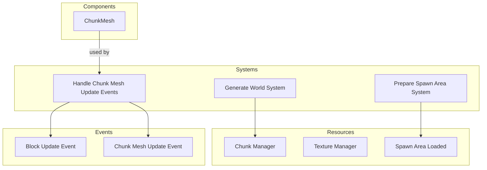

# Plugin: terrain

The Terrain plugin provides functionalities for managing and rendering a voxel-based terrain system in the game environment. It handles chunk generation, block management, and event-driven updates for the terrain.

## Dependencies
- `bevy`: Required for game engine functionalities such as rendering and event handling.

## Mermaid Diagram


## Components
- `ChunkMesh`: Represents a mesh associated with a chunk of terrain, containing data necessary for rendering.

## Resources
- `ChunkManager`: Manages all chunks in the terrain, providing functionality for chunk creation, retrieval, and block manipulation.
- `TextureManager`: Handles texture UV mappings for various blocks used in the terrain.
- `SpawnAreaLoaded`: Indicates whether the spawn area has been successfully loaded.

## Systems
- **Initialization**:
  - `Prepare Spawn Area System`: Sends requests to generate the initial spawn area chunks.
  - `Generate World System`: Requests additional chunks based on player position and render distance.
- **Updates**:
  - `Handle Chunk Mesh Update Events`: Listens for events signaling that a chunk's mesh needs to be updated or re-rendered.

## Context
- Includes files from the project's plugin directory.
- Incorporates [`prelude.rs`](https://github.com/CuddlyBunion341/hello-bevy/blob/main/src/client/prelude.rs) and networking systems specific to terrain management.

## Collected Source Files
- events.rs
- chunk.rs
- mesher.rs
- buffer_serializer.rs
- mod.rs (util)
- blocks.rs (util)
- systems.rs
- mod.rs (plugin)
- components.rs
- resources.rs

## Source Code Content

```rs
// ---- File: src/client/terrain/events.rs ----
use crate::prelude::*;

#[derive(Event)]
pub struct ChunkMeshUpdateEvent {
    pub position: Vec3,
}

#[derive(Event)]
pub struct BlockUpdateEvent {
    pub position: Vec3,
    pub block: BlockId,
    pub from_network: bool,
}

// ---- File: src/client/terrain/util/chunk.rs ----
// [Chunk implementation code]

// ---- File: src/client/terrain/util/mesher.rs ----
// [Mesher implementation code]

// ---- File: src/client/terrain/util/buffer_serializer.rs ----
// [Buffer serializer implementation code]

// ---- File: src/client/terrain/util/mod.rs ----
// [Util module code]

// ---- File: src/client/terrain/util/blocks.rs ----
// [Blocks implementation code]

// ---- File: src/client/terrain/systems.rs ----
// [Systems implementation code]

// ---- File: src/client/terrain/mod.rs ----
// [Terrain plugin implementation code]

// ---- File: src/client/terrain/components.rs ----
// [Components implementation code]

// ---- File: src/client/terrain/resources.rs ----
// [Resources implementation code]
```

This documentation serves as a reference for developers working with the Terrain plugin, detailing its structure, components, systems, and relevant source files. For further details on specific elements, please refer to the linked source files.
