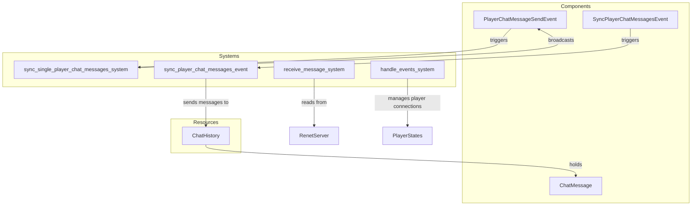

# Plugin: chat

The **chat** plugin facilitates in-game communication between players, allowing them to send and receive messages in real-time.

## Dependencies
- `bevy`: The game engine on which the plugin is built, necessary for app architecture and entity management.
- `bevy_renet`: Provides networking capabilities essential for message transmission between clients.
  
## Mermaid Diagram


## Components
- `ChatMessage`: Represents a chat message sent by a player, containing attributes such as `client_id`, `message_id`, and `timestamp`.

## Resources
- `ChatHistory`: Maintains a history of chat messages sent during the game session.

## Systems
- **Chat Management**:
  - `sync_single_player_chat_messages_system`: Broadcasts chat messages sent by a single player to all clients.
  - `sync_player_chat_messages_event`: Synchronizes the chat history with a specific client.
  
- **Networking**:
  - `receive_message_system`: Handles incoming messages from clients and dispatches appropriate events.
  - `handle_events_system`: Manages client connection events and synchronizes chat messages upon connection.

## Context
- Includes files from the project's plugin directory.
- Incorporates [`prelude.rs`](https://github.com/CuddlyBunion341/hello-bevy/blob/main/src/server/prelude.rs) and networking systems specific to the chat functionality.

## Collected Source Files
- [events.rs](https://github.com/CuddlyBunion341/hello-bevy/blob/main/src/server/chat/events.rs)
- [systems.rs](https://github.com/CuddlyBunion341/hello-bevy/blob/main/src/server/chat/systems.rs)
- [mod.rs](https://github.com/CuddlyBunion341/hello-bevy/blob/main/src/server/chat/mod.rs)
- [resources.rs](https://github.com/CuddlyBunion341/hello-bevy/blob/main/src/server/chat/resources.rs)

## Source Code Content

```rs
// ---- File: src/server/chat/events.rs ----
use crate::prelude::*;

#[derive(Event)]
pub struct PlayerChatMessageSendEvent {
    pub client_id: ClientId,
    pub message: String,
}

#[derive(Event)]
pub struct SyncPlayerChatMessagesEvent {
    pub client_id: ClientId,
}

// ---- File: src/server/chat/systems.rs ----
use std::time::UNIX_EPOCH;

use crate::prelude::*;

pub fn sync_single_player_chat_messages_system(
    mut server: ResMut<RenetServer>,
    mut player_send_messages: EventReader<chat_events::PlayerChatMessageSendEvent>,
    mut chat_messages: ResMut<chat_resources::ChatHistory>,
) {
    for event in player_send_messages.read() {
        let message = event.message.clone();
        let client_id = event.client_id;

        info!("Broadcasting message from sender {}", client_id);
        let message_count = chat_messages.messages.len();
        let message_id = message_count;

        let chat_message = lib::ChatMessage {
            client_id,
            message_id,
            message,
            timestamp: get_current_time_in_ms(),
        };

        chat_messages.messages.push(chat_message.clone());

        let response_message = lib::NetworkingMessage::SingleChatMessageSync(chat_message);

        server.broadcast_message(
            DefaultChannel::ReliableOrdered,
            bincode::serialize(&response_message).unwrap(),
        );
    }
}

pub fn sync_player_chat_messages_event(
    mut server: ResMut<RenetServer>,
    mut events: EventReader<chat_events::SyncPlayerChatMessagesEvent>,
    chat_messages: ResMut<chat_resources::ChatHistory>,
) {
    for event in events.read() {
        let client_id = event.client_id;
        info!("Synchronizing messages with client {}", client_id);

        let history = chat_messages.messages.clone();
        let response_message =
            bincode::serialize(&lib::NetworkingMessage::ChatMessageSync(history)).unwrap();
        server.send_message(client_id, DefaultChannel::ReliableOrdered, response_message);
    }
}

fn get_current_time_in_ms() -> i64 {
    let start = SystemTime::now();
    let since_the_epoch = start.duration_since(UNIX_EPOCH);
    match since_the_epoch {
        Ok(time) => match time.as_millis().try_into() {
            Ok(casted_time) => casted_time,
            Err(_error) => {
                error!("Could not cast time milis to u32");
                0
            }
        },
        Err(_error) => {
            error!("Could not fetch system time");
            0
        }
    }
}

// ---- File: src/server/chat/mod.rs ----
use crate::prelude::*;

pub mod events;
pub mod resources;
pub mod systems;

pub struct ChatPlugin;

impl Plugin for ChatPlugin {
    fn build(&self, app: &mut App) {
        info!("Building ChatPlugin");
        app.insert_resource(resources::ChatHistory::new());
        app.add_systems(
            Update,
            (
                chat_systems::sync_player_chat_messages_event,
                chat_systems::sync_single_player_chat_messages_system,
            ),
        );
        app.add_event::<chat_events::PlayerChatMessageSendEvent>();
        app.add_event::<chat_events::SyncPlayerChatMessagesEvent>();
    }
}

// ---- File: src/server/chat/resources.rs ----
use crate::prelude::*;

#[derive(Resource, Debug)]
pub struct ChatHistory {
    pub messages: Vec<lib::ChatMessage>,
}

impl ChatHistory {
    pub fn new() -> Self {
        Self {
            messages: Vec::new(),
        }
    }
}

impl Default for ChatHistory {
    fn default() -> Self {
        Self::new()
    }
}
```
