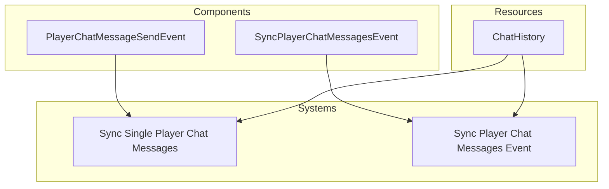

# Plugin: chat

The chat plugin facilitates real-time messaging among players in the game. It manages sending and receiving chat messages, synchronizing chat history, and broadcasting updates to connected clients.

## Dependencies
- `Renet`: A networking library that provides reliable communication between clients and the server, essential for real-time chat functionality.

## Mermaid Diagram

## Components
- `PlayerChatMessageSendEvent`: Represents an event triggered when a player sends a chat message.
- `SyncPlayerChatMessagesEvent`: Represents an event to synchronize chat messages with a specific player.

## Resources
- `ChatHistory`: Stores the history of chat messages exchanged between players.

## Systems
- **Chat Management**:
  - `sync_single_player_chat_messages_system`: Synchronizes messages sent by a single player to all other players.
  - `sync_player_chat_messages_event`: Synchronizes chat history with newly connected players.

## Context
- Includes files from the project's plugin directory.
- Incorporates [prelude.rs](https://github.com/CuddlyBunion341/hello-bevy/blob/main/src/server/prelude.rs) and networking systems specific to the chat functionality.

## Collected Source Files
- [events.rs](https://github.com/CuddlyBunion341/hello-bevy/blob/main/src/server/chat/events.rs)
- [systems.rs](https://github.com/CuddlyBunion341/hello-bevy/blob/main/src/server/chat/systems.rs)
- [mod.rs](https://github.com/CuddlyBunion341/hello-bevy/blob/main/src/server/chat/mod.rs)
- [resources.rs](https://github.com/CuddlyBunion341/hello-bevy/blob/main/src/server/chat/resources.rs)
