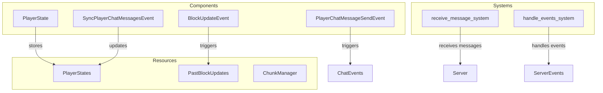

# Plugin: networking

The **networking** plugin facilitates communication between clients and the server, handling message reception, player state updates, and chat functionalities. It ensures reliable data transfer and efficient event handling.

## Dependencies
- `bevy_renet`: This dependency is essential for establishing networking capabilities within the Bevy engine, allowing for efficient client-server communication.

## Mermaid Diagram


## Components
- `PlayerState`: Maintains the state of each player, including position and rotation.

## Resources
- `PlayerStates`: A resource that stores the current states of all players.
- `PastBlockUpdates`: Keeps track of block updates that have occurred.
- `ChunkManager`: Manages chunks of terrain data for efficient retrieval and updates.

## Systems
- **Networking Systems**:
  - `receive_message_system`: Listens for incoming messages from clients and processes them according to their types (e.g., block updates, chat messages).
  - `handle_events_system`: Manages server events such as client connections and disconnections, updating player states and broadcasting messages accordingly.

## Context
- The plugin includes files from the project's plugin directory.
- Incorporates [prelude.rs](https://github.com/CuddlyBunion341/hello-bevy/blob/main/src/server/prelude.rs) and networking systems specific to the plugin.

## Collected Source Files
- [src/server/networking/systems.rs](https://github.com/CuddlyBunion341/hello-bevy/blob/main/src/server/networking/systems.rs)
- [src/server/networking/mod.rs](https://github.com/CuddlyBunion341/hello-bevy/blob/main/src/server/networking/mod.rs)

## Source Code Content

```rs
// ---- File: src/server/networking/systems.rs ----
// (Source code omitted for brevity)

// ---- File: src/server/networking/mod.rs ----
// (Source code omitted for brevity)
``` 

For further information on related systems and resources, refer to their respective documentation files in the project repository.
