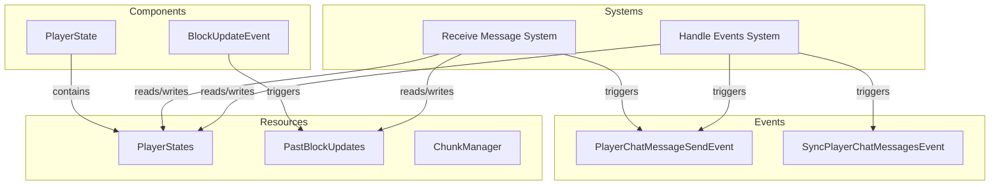

# Plugin: Networking

The Networking plugin facilitates communication between clients and the server, enabling message exchange and state synchronization in a multiplayer environment.

## Dependencies
- **Bevy**: Provides the foundational framework for building the game.
- **Renet**: Handles reliable network transport and client-server architecture.

## Mermaid Diagram

## Components
- **PlayerState**: Represents the current state of a player, including position and rotation.

## Resources
- **PlayerStates**: Maintains a collection of all player states currently active in the game.
- **PastBlockUpdates**: Stores updates about block changes made by players.
- **ChunkManager**: Manages chunks of the game world to facilitate loading and unloading of terrain.

## Systems
- **Networking Systems**:
  - **Receive Message System**: Handles incoming messages from clients, processes them, and updates relevant resources.
  - **Handle Events System**: Responds to server events such as client connections and disconnections, updating player states accordingly.

## Context
- Includes files from the project's plugin directory.
- Incorporates [`prelude.rs`](https://github.com/CuddlyBunion341/hello-bevy/blob/main/src/server/prelude.rs) and networking systems specific to this plugin.

## Collected Source Files
- [`systems.rs`](https://github.com/CuddlyBunion341/hello-bevy/blob/main/src/server/networking/systems.rs)
- [`mod.rs`](https://github.com/CuddlyBunion341/hello-bevy/blob/main/src/server/networking/mod.rs)
