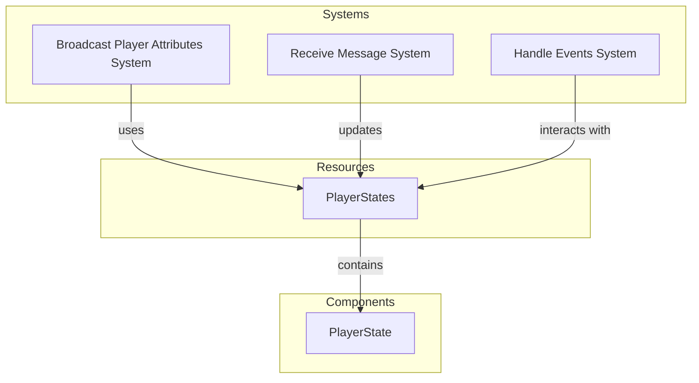

# Plugin: Player

The Player plugin manages player states, including their attributes and interactions in a multiplayer game environment. It facilitates player updates, broadcasting of messages, and handles client connections.

## Dependencies
- **Renet**: This dependency is essential for managing network communication between clients and the server, allowing for reliable message transmission.

## Mermaid Diagram

## Components
- **PlayerState**: Represents the state of a player, including position and rotation.

## Resources
- **PlayerStates**: Holds the current states of all players connected to the server, allowing for easy updates and retrieval.

## Systems
- **Update Systems**:
  - `broadcast_player_attributes_system`: Sends the current attributes of players to all connected clients.
  - `receive_message_system`: Handles incoming messages from clients and updates player states accordingly.
  - `handle_events_system`: Manages events related to client connections and disconnections, updating player states as necessary.

## Context
- Includes files from the project's plugin directory.
- Incorporates [`prelude.rs`](https://github.com/CuddlyBunion341/hello-bevy/blob/main/src/server/prelude.rs) for common functionality and networking systems specific to player management.

## Collected Source Files
- [`systems.rs`](https://github.com/CuddlyBunion341/hello-bevy/blob/main/src/server/player/systems.rs)
- [`mod.rs`](https://github.com/CuddlyBunion341/hello-bevy/blob/main/src/server/player/mod.rs)
- [`resources.rs`](https://github.com/CuddlyBunion341/hello-bevy/blob/main/src/server/player/resources.rs)
