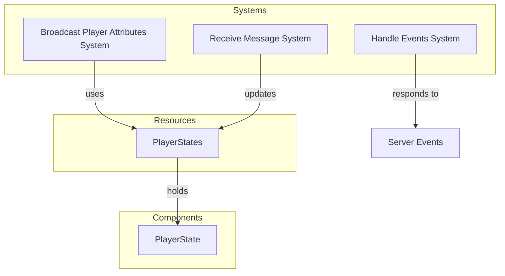

# Plugin: Player

The Player plugin manages player states and interactions in the game, including broadcasting player attributes and handling networking events related to player actions.

## Dependencies
- `bevy`: A game engine framework that provides the necessary functionalities for building games.
- `bevy_renet`: A networking library for Bevy that facilitates reliable communication between clients and the server.

## Mermaid Diagram


## Components
- `PlayerState`: Represents the state of a player, including position and rotation.

## Resources
- `PlayerStates`: Manages the collection of all active player states in the game.

## Systems
- **Update Systems**:
  - `broadcast_player_attributes_system`: Sends updates about player states to connected clients.
  - `receive_message_system`: Handles incoming messages from clients, processing player updates, block updates, and chat messages.
  - `handle_events_system`: Manages events related to client connections and disconnections, updating player states accordingly.

## Context
- Includes files from the project's plugin directory, specifically managing player-related resources and systems.
- Incorporates [`prelude.rs`](https://github.com/CuddlyBunion341/hello-bevy/blob/main/src/server/prelude.rs) to utilize common dependencies and functionality across the plugin.

## Collected Source Files
- systems.rs
- mod.rs
- resources.rs

## Source Code Content

```rs
// ---- File: src/server/player/systems.rs ----
use crate::prelude::*;

pub fn broadcast_player_attributes_system(
    mut server: ResMut<RenetServer>,
    player_states: Res<player_resources::PlayerStates>,
) {
    for client_id in server.clients_id() {
        let mut other_player_states = player_states.players.clone();
        other_player_states.remove(&client_id);

        server.send_message(
            client_id,
            DefaultChannel::ReliableUnordered,
            bincode::serialize(&lib::NetworkingMessage::PlayerSync(other_player_states)).unwrap(),
        );
    }
}

// ---- File: src/server/player/mod.rs ----
use crate::prelude::*;

pub mod resources;
pub mod systems;

pub struct PlayerPlugin;

impl Plugin for PlayerPlugin {
    fn build(&self, app: &mut App) {
        app.insert_resource(player_resources::PlayerStates::new());
        app.add_systems(Update, player_systems::broadcast_player_attributes_system);
    }
}

// ---- File: src/server/player/resources.rs ----
use crate::prelude::*;

#[derive(Resource)]
pub struct PlayerStates {
    pub players: HashMap<ClientId, lib::PlayerState>,
}

impl PlayerStates {
    pub fn new() -> Self {
        Self {
            players: HashMap::new(),
        }
    }
}

impl Default for PlayerStates {
    fn default() -> Self {
        Self::new()
    }
}
```
