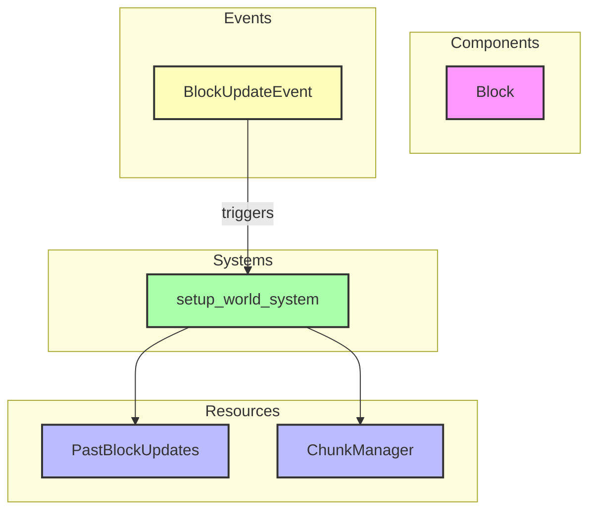

# Plugin: terrain

The Terrain plugin is responsible for managing and generating the terrain within the game world, including the creation of blocks and chunks.

## Dependencies
- **Bevy**: The core game engine used for building the application.

## Mermaid Diagram


## Components
- **Block**: Represents a single block in the terrain with properties such as its ID and whether it is solid.

## Resources
- **PastBlockUpdates**: Stores a list of block update events that have occurred.
- **ChunkManager**: Manages the collection of chunks of terrain in the world.

## Systems
- **Terrain Generation**:
  - `setup_world_system`: Initializes the world by generating chunks based on specified render distances.

## Context
- Includes files from the project's plugin directory.
- Incorporates [`prelude.rs`](https://github.com/CuddlyBunion341/hello-bevy/blob/main/src/server/prelude.rs) for common utilities and types.

## Collected Source Files
- [events.rs](https://github.com/CuddlyBunion341/hello-bevy/blob/main/src/server/terrain/events.rs)
- [mod.rs](https://github.com/CuddlyBunion341/hello-bevy/blob/main/src/server/terrain/mod.rs)
- [blocks.rs](https://github.com/CuddlyBunion341/hello-bevy/blob/main/src/server/terrain/util/blocks.rs)
- [generator.rs](https://github.com/CuddlyBunion341/hello-bevy/blob/main/src/server/terrain/util/generator.rs)
- [systems.rs](https://github.com/CuddlyBunion341/hello-bevy/blob/main/src/server/terrain/systems.rs)
- [resources.rs](https://github.com/CuddlyBunion341/hello-bevy/blob/main/src/server/terrain/resources.rs)

## Source Code Content

```rs
// ---- File: src/server/terrain/events.rs ----
use crate::prelude::*;

#[derive(Event)]
pub struct BlockUpdateEvent {
    pub position: Vec3,
    pub block: BlockId,
}

// ---- File: src/server/terrain/util/mod.rs ----
pub mod blocks;
pub mod generator;

pub use blocks::*;
pub use generator::*;

// ---- File: src/server/terrain/util/blocks.rs ----
use crate::prelude::*;

pub struct Block {
    pub id: BlockId,
    pub is_solid: bool,
}

macro_rules! add_block {
    ($block_id:expr, $is_solid:expr) => {
        Block {
            id: $block_id,
            is_solid: $is_solid,
        }
    };
}

pub static BLOCKS: [Block; 14] = [
    add_block!(BlockId::Air, false),
    add_block!(BlockId::Grass, true),
    add_block!(BlockId::Dirt, true),
    add_block!(BlockId::Stone, true),
    add_block!(BlockId::Bedrock, true),
    add_block!(BlockId::RedSand, true),
    add_block!(BlockId::BrownTerracotta, true),
    add_block!(BlockId::CyanTerracotta, true),
    add_block!(BlockId::GrayTerracotta, true),
    add_block!(BlockId::LightGrayTerracotta, true),
    add_block!(BlockId::OrangeTerracotta, true),
    add_block!(BlockId::RedTerracotta, true),
    add_block!(BlockId::Terracotta, true),
    add_block!(BlockId::YellowTerracotta, true),
];

// ---- File: src/server/terrain/util/generator.rs ----
use crate::prelude::*;
use lib::CHUNK_SIZE;

pub struct Generator {
    pub seed: u32,
    perlin: Perlin,
}

impl Generator {
    pub fn new(seed: u32) -> Generator {
        Generator {
            seed,
            perlin: Perlin::new(seed),
        }
    }

   // Additional methods...
}

// ---- File: src/server/terrain/systems.rs ----
use crate::prelude::*;

pub fn setup_world_system(mut chunk_manager: ResMut<terrain_resources::ChunkManager>) {
   // Logic to setup world...
}

// ---- File: src/server/terrain/mod.rs ----
use crate::prelude::*;

pub mod events;
pub mod resources;
pub mod systems;
pub mod util;

pub struct TerrainPlugin;

impl Plugin for TerrainPlugin {
   fn build(&self, app: &mut App) {
       app.insert_resource(terrain_resources::ChunkManager::new());
       app.add_event::<terrain_events::BlockUpdateEvent>();
       app.insert_resource(resources::PastBlockUpdates::new());
       app.add_systems(Startup, terrain_systems::setup_world_system);
   }
}

// ---- File: src/server/terrain/resources.rs ----
use crate::prelude::*;
use lib::CHUNK_SIZE;

#[derive(Resource)]
pub struct PastBlockUpdates {
   pub updates: Vec<BlockUpdateEvent>,
}

impl Default for PastBlockUpdates {
   fn default() -> Self {
       Self { updates: Vec::new() }
   }
}

#[derive(Resource)]
pub struct ChunkManager {
   pub chunks: HashMap<[i32; 3], lib::Chunk>,
}

impl Default for ChunkManager {
   fn default() -> Self {
       Self { chunks: HashMap::new() }
   }
}
```
