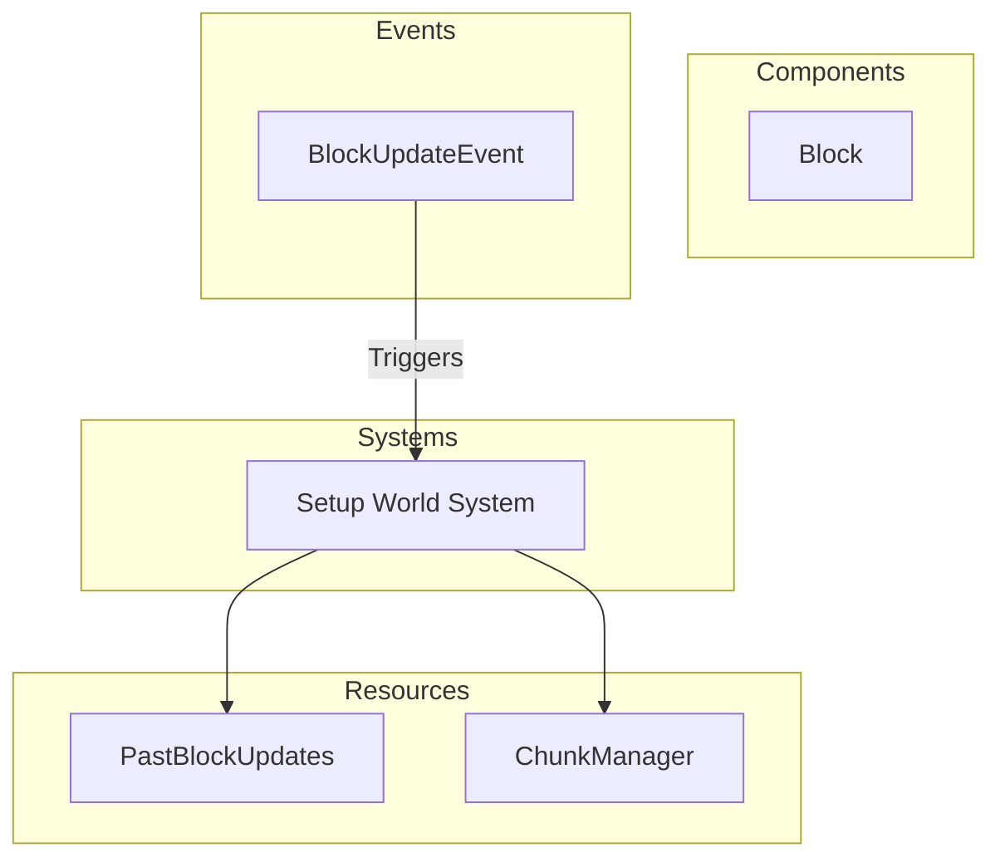

# Plugin: Terrain

The Terrain plugin is responsible for generating and managing the terrain blocks in the game environment. It includes utilities for block management, a generator for creating terrain chunks, and systems to handle chunk instantiation and updates.

## Dependencies
- **`bevy`**: Required for the ECS framework and basic game functionality.
- **`noise`**: Used for procedural generation of terrain via Perlin noise.

## Mermaid Diagram

## Components
- **Block**: Represents a single block in the terrain, including its ID and solidity status.

## Resources
- **PastBlockUpdates**: Stores a history of block updates to support synchronization across clients.
- **ChunkManager**: Manages chunks of terrain, allowing for instantiation, retrieval, and manipulation of block data.

## Systems
- **Terrain Generation**:
  - **Setup World System**: Initializes the world by generating terrain chunks based on specified parameters.

## Context
- The Terrain plugin incorporates files from the project's plugin directory. It utilizes `prelude.rs` for common imports and networking systems related to terrain updates.

## Collected Source Files
- [events.rs](https://github.com/CuddlyBunion341/hello-bevy/blob/main/src/server/terrain/events.rs)
- [mod.rs](https://github.com/CuddlyBunion341/hello-bevy/blob/main/src/server/terrain/mod.rs)
- [blocks.rs](https://github.com/CuddlyBunion341/hello-bevy/blob/main/src/server/terrain/util/blocks.rs)
- [generator.rs](https://github.com/CuddlyBunion341/hello-bevy/blob/main/src/server/terrain/util/generator.rs)
- [systems.rs](https://github.com/CuddlyBunion341/hello-bevy/blob/main/src/server/terrain/systems.rs)
- [resources.rs](https://github.com/CuddlyBunion341/hello-bevy/blob/main/src/server/terrain/resources.rs)

For more details about the plugin's architecture and functionality, refer to the source files linked above.
